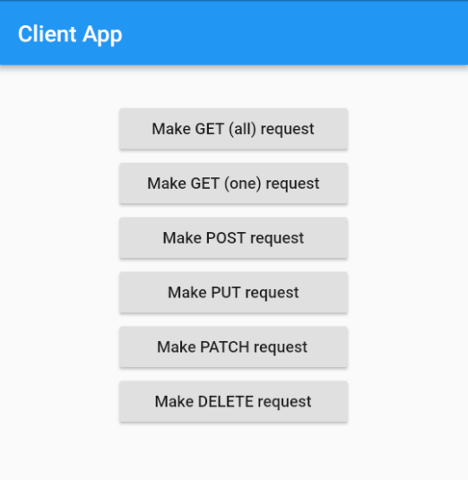

# Backend Demo

Client-server communication demo for Node.js, Server Side Dart, Android, iOS, and Flutter for the tutorial [Becoming a backend developer: A guide for mobile app developers](TODO)

The included files are not full projects. So just start a new Node.js, Dart, Android, iOS, or Flutter project and then replace the critical configuration, layout, and code files with those provided in the appropriate directory above.
